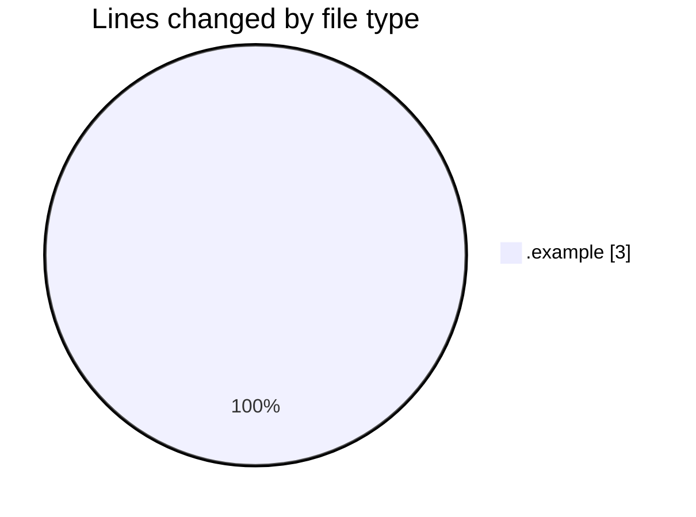
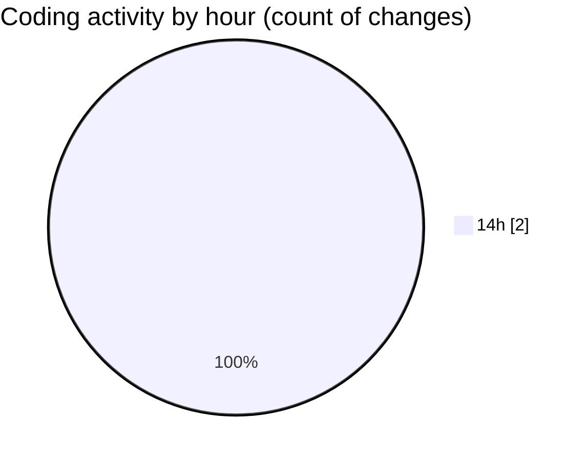

# PythonProjects - Activity Summary 

## Overall Statistics

| Stat                   | Value                                                             |
| ---------------------- | ----------------------------------------------------------------- |
| **Lines Added** (➕)   | 2                                          |
| **Lines Removed** (➖) | 1                                        |
| **Net Change** (↕)    | 1                |
| **Active Time** (⌚)   | 1 minute |

## Modified Files
- **.env.example** (+2, -1)

## Visualizations

### By File Type (Lines Changed)

### By Hour (Estimated Activity Count)

> **Last Updated:** 16/07/2026, 14:41:47