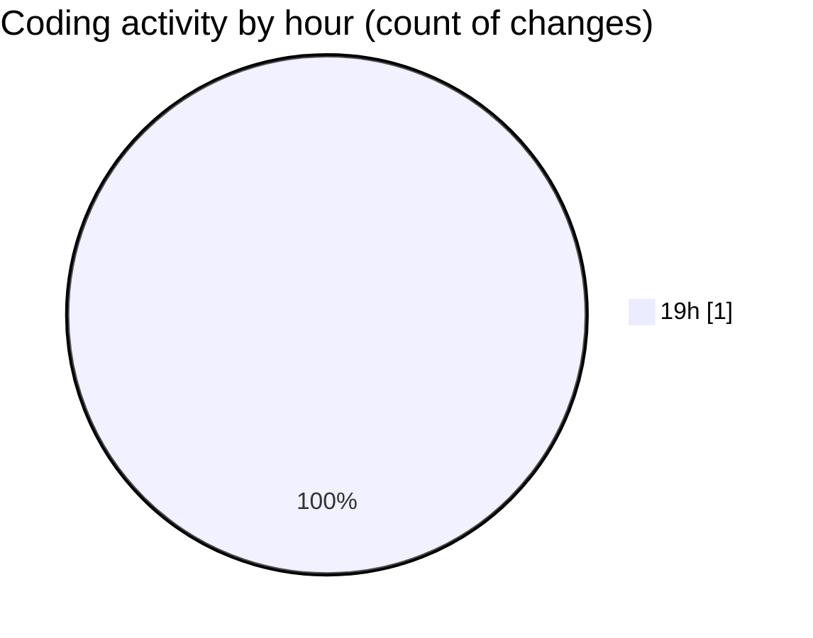

# PythonProjects - Activity Summary 

## Overall Statistics

| Stat                   | Value                                                             |
| ---------------------- | ----------------------------------------------------------------- |
| **Lines Added** (➕)   | 256                                          |
| **Lines Removed** (➖) | 0                                        |
| **Net Change** (↕)    | 256                |
| **Active Time** (⌚)   | 0 minute |

## Modified Files
- **global.css** (+256, -0)

## Visualizations

### By File Type (Lines Changed)

### By Hour (Estimated Activity Count)

> **Last Updated:** 17/07/2026, 19:14:14