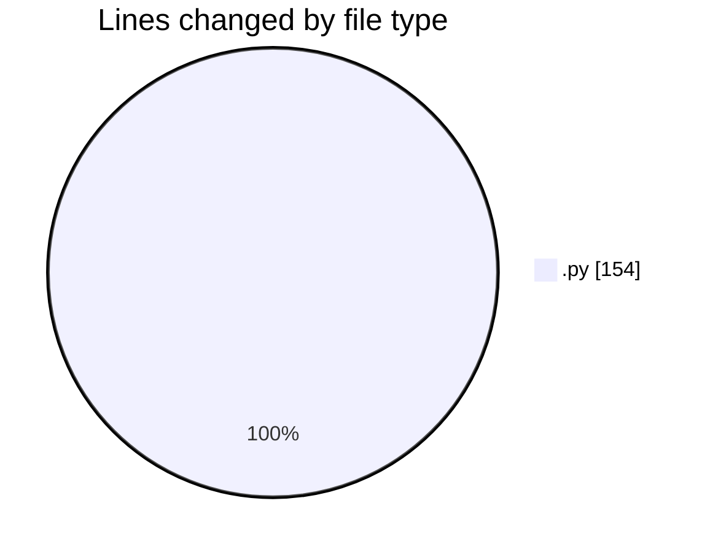
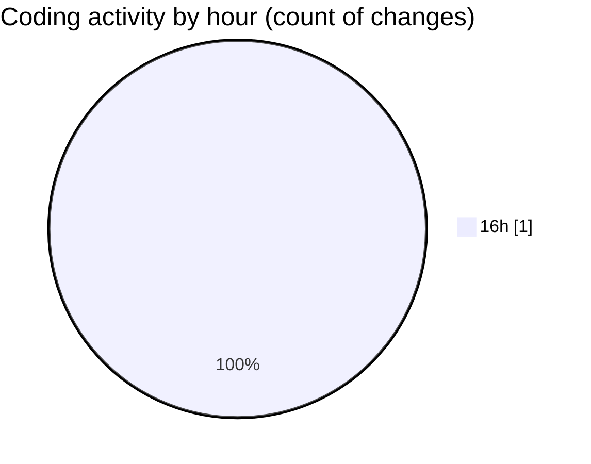

# Untitled (Workspace) - Activity Summary 

## Overall Statistics

| Stat                   | Value                                                             |
| ---------------------- | ----------------------------------------------------------------- |
| **Lines Added** (➕)   | 154                                          |
| **Lines Removed** (➖) | 0                                        |
| **Net Change** (↕)    | 154                |
| **Active Time** (⌚)   | 0 minute |

## Modified Files
- **scraper.py** (+154, -0)

## Visualizations

### By File Type (Lines Changed)

### By Hour (Estimated Activity Count)

> **Last Updated:** 04/08/2026, 16:58:56